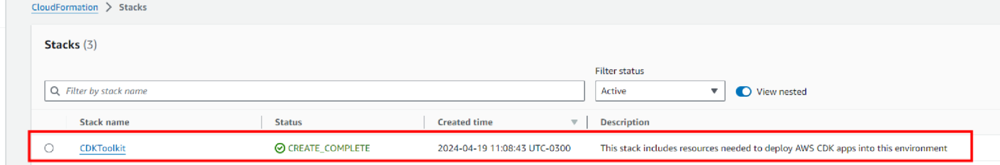
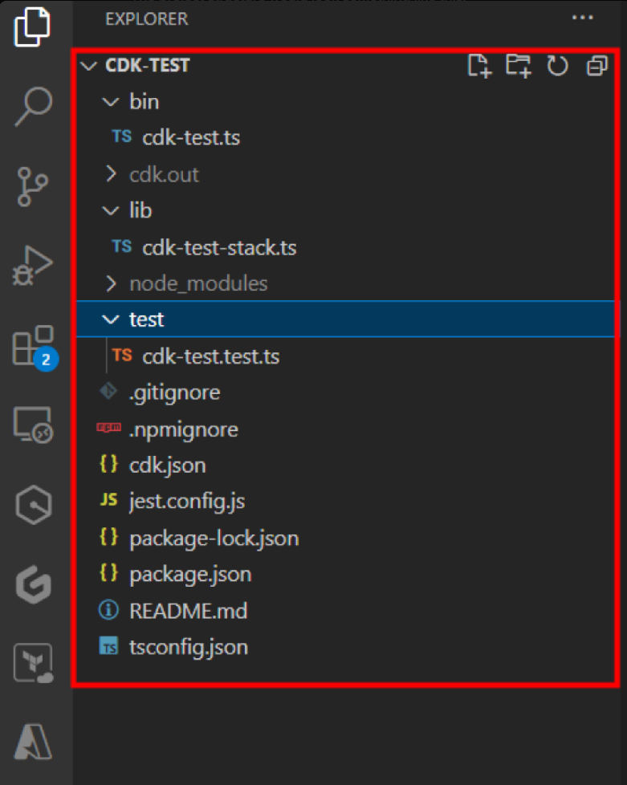
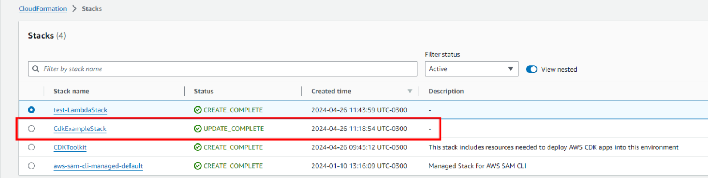
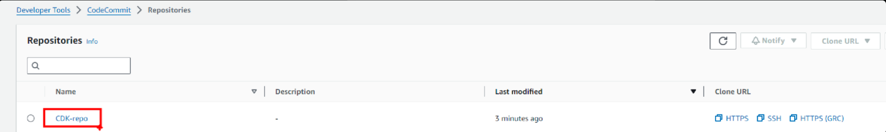
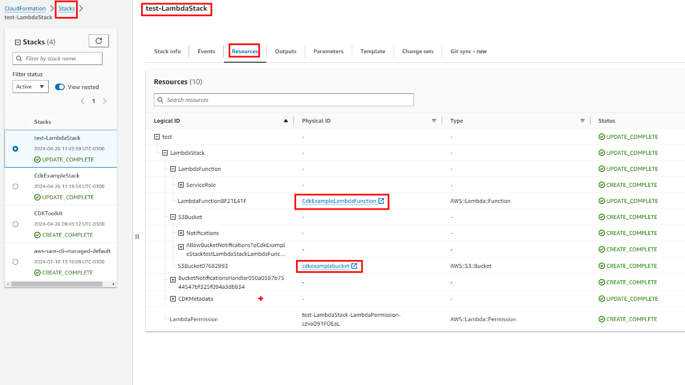
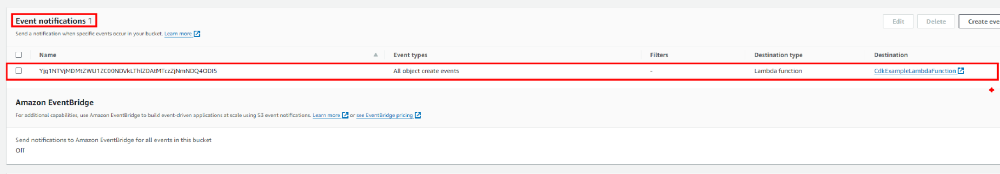

# Welcome to your CDK TypeScript project

This is a blank project for CDK development with TypeScript.

The `cdk.json` file tells the CDK Toolkit how to execute your app.

## Useful commands

* `npm run build`   compile typescript to js
* `npm run watch`   watch for changes and compile
* `npm run test`    perform the jest unit tests
* `npx cdk deploy`  deploy this stack to your default AWS account/region
* `npx cdk diff`    compare deployed stack with current state
* `npx cdk synth`   emits the synthesized CloudFormation template


# CDK Usage Example

## Introduction

In this Repo, we are going to make a little introduction to AWS CDK. AWS CDK (Cloud Development Kit) is an open-source software development framework for defining cloud infrastructure in code and provisioning it through AWS CloudFormation. It allows developers to define cloud resources using familiar programming languages such as TypeScript, Python, Java, and C#.

## Bootstrap an environment

To start deploying a stack and its resources or a new app into AWS, you need to bootstrap the environment where you want to deploy. You need to specify the Account ID and the region where you want to deploy, and CDK will create a new stack called CDK-Toolkit. This stack includes resources that are used in the toolkit’s operation. For example, the stack includes an S3 bucket that is used to store templates and assets during the deployment process. This stack provides all the necessary resources for you to be able to make deployments to your AWS account using CDK. You can do this by running this command: 
* `cdk bootstrap aws://ACCOUNT-NUMBER/REGION`

## CDK App

Your CDK App will consist of at least 2 stacks:
* One that represents the CDK pipeline itself ⟶ it will orchestrate the execution of the deployment of the app stack every time a new change is pushed to a repository
* One or more stacks that represent the application deployed through the pipeline ⟶ Each time a change in the app is pushed to a repo, the CDK Pipeline will deploy those changes automatically

Stacks can also be grouped into stages, which you can use to deploy copies of infrastructure stacks to different environments.

## Synthesize a template from your app

Once you have your CDK App ready to deploy, when you execute the app, CDK will synthesize it first, meaning that all the code you wrote in which you declared the Stacks along with their resources and configurations, will be synthesized into a CloudFormation template for each of the stacks you defined in the app. You can preview the CloudFormation template by running this command:
* `cdk synth`

## Example

Suppose we want to create a CDK App with only one stack, which would be the CDK Pipeline stack. First, we need to bootstrap our AWS Environment so we can make deployments using CDK. In a CMD, being logged in AWS with our credentials using AWS configure , we are going to run this command:
* `cdk bootstrap aws://{YOUR-AWS-ACCOUNT-NUMBER}/{REGION}`

This will create a new stack in your AWS account. Like this one:



Now that we have bootstrapped our environment in AWS where we want to deploy our CDK App, we can initiate a new CDK App in a local directory. Create a new directory in your File Explorer, and run this command:
* `cdk init sample-app --language typescript`

Here instead of typescript, AWS CDK is generally available in these languages also: JavaScript, Python, Java, C#, and Go

The project structure would look something like this:



* lib/cdk-test-stack.ts is where your CDK application’s main stack is defined. This is the file we’ll be spending most of our time in.
* bin/cdk-test.ts is the entrypoint of the CDK application. It will load the stack defined in lib/cdk-workshop-stack.ts.
* cdk.json tells the toolkit how to run your app. In our case it will be "npx ts-node bin/cdk-workshop.ts"

Now, let's define our pipeline stack.
In bin/cdk-example.ts

```
#!/usr/bin/env node
import * as cdk from 'aws-cdk-lib';
import { CdkExampleStack } from '../lib/cdk-example-stack';

const app = new cdk.App();
new CdkExampleStack(app, 'CdkExampleStack', {
  env: {
    account: '{YOUR-ACCOUNT-ID}',
    region: 'us-east-1',
  }
});

app.synth();
```

In lib/cdk-example-stack.ts
If you want to work with a CodeCommit Repository in AWS, follow up on this code

```
import * as cdk from 'aws-cdk-lib';
import { Construct } from 'constructs';
import { CodePipeline, CodePipelineSource, ShellStep } from 'aws-cdk-lib/pipelines';
import * as codecommit from 'aws-cdk-lib/aws-codecommit';

export class CdkExampleStack extends cdk.Stack {
    constructor(scope: Construct, id: string, props?: cdk.StackProps) {
        super(scope, id, props);
        const repo = new codecommit.Repository(this, 'CDK-repo', {
            repositoryName: "CDK-repo"
        });
        const pipeline = new CodePipeline(this, 'Pipeline', {
            pipelineName: 'MyPipeline',
            synth: new ShellStep('Synth', {
                input: CodePipelineSource.codeCommit(repo, 'main'),
                installCommands: [
                    'npm install -g aws-cdk'
                ],
                commands: [
                    'npm ci',
                    'npm run build',
                    'npx cdk synth'
                ]
            })
        });
    }
}
```

Once both files are ready and all the resources you want to be deployed in that stack are declared and configured correctly (in the example, just the pipeline), you can run the command to deploy the stack into the AWS account. Run this command:
* `cdk deploy`

**You must deploy a pipeline manually once. After that, the pipeline keeps itself up to date from the source code repository.**

The CDK will start the deployment and you shall see a new stack created in the AWS account once the deployment has finished. In this case, we created also a CodeCommit repository to work on, so this repo should also be created





Now we have our Stack deployed and created in our AWS environment. This Stack consists mainly of 2 resources: a CodePipeline and a CodeCommit Repository. Now, we will add to our CDK App, a new Stack, consisting of the App stack, the app that will be deployed through the CodePipeline. As I said earlier, stacks can also be grouped into stages. So, we will add a new stage to the pipeline, and that stage will consist of a stack containing all the necessary resources for our App. In this case, as an example, we will deploy a stack with a Lambda Function and an S3 Bucket in it. We will also create and assign to the S3 Bucket an S3 Event Notification, so when an object is created in the Bucket, it will trigger the Lamda Function. In order for the Bucket to be able to trigger the Lambda, we will configure the Lambda Function with a Lambda Permission Policy.

Create the new file lib/cdk-example-lambda-stack.ts to hold our application stack containing our resources and configuration:

```
import * as cdk from 'aws-cdk-lib';
import { Construct } from 'constructs';
import { Function, InlineCode, Runtime } from 'aws-cdk-lib/aws-lambda';
import { Bucket } from 'aws-cdk-lib/aws-s3';

export class MyLambdaStack extends cdk.Stack {
    constructor(scope: Construct, id: string, props?: cdk.StackProps) {
        super(scope, id, props);

        const lambda = new Function(this, 'LambdaFunction', {
            functionName: "CdkExampleLambdaFunction",
            runtime: Runtime.NODEJS_18_X,
            handler: 'index.handler',
            code: new InlineCode(
                `exports.handler = async (event) => {
            console.log('Object created in Bucket');
            return "Object created in Bucket";
        };`
            )
        });

        const s3Bucket = new Bucket(this, 'S3Bucket', {
            bucketName: "cdkexamplebucket"
        });

        new cdk.aws_lambda.CfnPermission(this, 'LambdaPermission', {
            functionName: lambda.functionName,
            action: 'lambda:InvokeFunction',
            principal: 's3.amazonaws.com',
            sourceArn: s3Bucket.bucketArn,
            sourceAccount: '{YOUR-ACCOUNT-ID}'
        });

        s3Bucket.addEventNotification(cdk.aws_s3.EventType.OBJECT_CREATED, new cdk.aws_s3_notifications.LambdaDestination(lambda));
    }
}
```

Create the new file lib/cdk-example-app-stage.ts to hold our stage:

```
import * as cdk from 'aws-cdk-lib';
import { Construct } from "constructs";
import { MyLambdaStack } from './cdk-example-lambda-stack';

export class CdkExampleAppStage extends cdk.Stage {

    constructor(scope: Construct, id: string, props?: cdk.StageProps) {
      super(scope, id, props);

      const lambdaStack = new MyLambdaStack(this, 'LambdaStack');
    }
}
```
Edit lib/cdk-example-stack.ts to add the stage to our pipeline.

```
 pipeline.addStage(new CdkExampleAppStage(this, "test", {
            env: { account: "{YOUR-ACCOUNT-ID}", region: "us-east-1" }
  }));
```

The file then should look something like this:

```
import * as cdk from 'aws-cdk-lib';
import { Construct } from 'constructs';
import { CodePipeline, CodePipelineSource, ShellStep } from 'aws-cdk-lib/pipelines';
import * as codecommit from 'aws-cdk-lib/aws-codecommit';
import { CdkExampleAppStage } from './cdk-example-app-stage';

export class CdkExampleStack extends cdk.Stack {
    constructor(scope: Construct, id: string, props?: cdk.StackProps) {
        super(scope, id, props);
        const repo = new codecommit.Repository(this, 'CDK-repo', {
            repositoryName: "CDK-repo"
        });
        const pipeline = new CodePipeline(this, 'Pipeline', {
            pipelineName: 'MyPipeline',
            synth: new ShellStep('Synth', {
                input: CodePipelineSource.codeCommit(repo, 'main'),
                installCommands: [
                    'npm install -g aws-cdk'
                ],
                commands: [
                    'npm ci',
                    'npm run build',
                    'npx cdk synth'
                ]
            })
        });
        pipeline.addStage(new CdkExampleAppStage(this, "test", {
            env: { account: "{YOUR-ACCOUNT-ID}", region: "us-east-1" }
        }));
    }
}
```

Now, since we already ran the cdk deploy command and as a result we have our CodeCommit Repository deployed and created into our AWS environment, we push these CDK App changes into the CDK-Repo . This will automatically trigger the CodePipeline we also have already deployed and created in our AWS environment, and all the stages of the pipeline will run. When the pipeline is done, you should see your new App Stack created, along with the Lambda Function and S3 Bucket resources within it (or any other resource/s you declare within your stack):



And here it is the Event Notification for the S3 Bucket:



## Delete Stack

If you want to delete the stack, just run this command:
* `cdk destroy {STACK-NAME}`

## Helpful Links

If you have any doubts, you can check out these links:
* https://docs.aws.amazon.com/cdk/v2/guide/cdk_pipeline.html
* https://cdkworkshop.com/20-typescript/20-create-project.html
